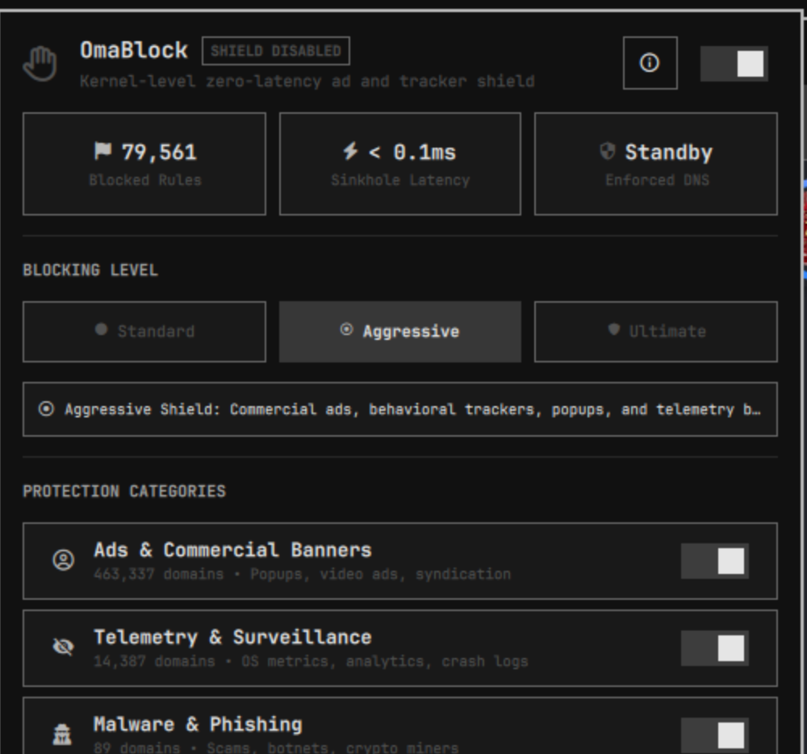

# OmaBlock - Omarchy Linux İçin Sıfır Gecikmeli Reklam Engelleyici ve Gizlilik Kalkanı

[](https://github.com/ozdil)

[](https://buymeacoffee.com/ozdil)



> **Omarchy Linux için çekirdek ve sistem seviyesinde, sıfır gecikmeli reklam ve takipçi engelleyici.**

OmaBlock; tarayıcı eklentilerine bağımlı kalmadan tüm sistem genelinde reklam, telemetri, kötü amaçlı yazılım ve takipçileri engeller. Yapay zeka destekli DGA / phishing tespiti, netfilter / nftables kuralları ve kullanıcı alanında yüksek güvenlikli Rust motoru (`omablock-engine`) ile çalışır.

---

## Yetenekler ve Özellikler

- **Sistem Düzeyinde Sıfır Gecikme:**
  - DNS seviyesinde engelleme ile tarayıcı eklentilerinin bellek ve işlemci yükünü ortadan kaldırır.
- **Yapay Zeka Destekli DGA ve Oltalama Koruması:**
  - Shannon entropisi ve sezgisel algoritmalar ile sahte/üretilmiş alan adlarını tespit eder.
- **Kategori Bazlı Seçici Filtreleme:**
  - Reklamlar, Telemetri, Kötü Amaçlı Yazılımlar, Sosyal Takipçiler ve Açılır Pencereler (Pop-ups) bağımsız yönetilebilir.
- **OmaBlock Shield Bridge (Chrome & Chromium Köprüsü):**
  - Çekirdek seviyesindeki DNS sinkhole korumasını tarayıcı içine taşıyan Manifest V3 uzantısı. DonanımHaber, Haberler.com gibi sitelerdeki first-party gömülü bannerları ve DOM içi reklam alanlarını sıfır gecikmeyle yok eder.
- **Klavye Kısayolları ve Ergonomi:**
  - Space/Enter (aç/kapat), r (yenile), t (canlı test çalıştır), u (kuralları güncelle), a (künye overlay).
- **Omarchy Tema Entegrasyonu:**
  - `JetBrainsMono Nerd Font` tipografi standardı ve dinamik sistem renkleri.

---

## Kurulum ve Yapılandırma

### Omarchy Eklentisini Ekleme
```bash
omarchy plugin add https://github.com/ozdil/omarchy-omablock.git
```

### Motoru Kaynaktan Derleme
```bash
cd ~/.config/omarchy/plugins/ozdil.omablock
cargo build --release
install -m 755 target/release/omablock-engine ./omablock-engine
```

### Omarchy Shell Yapılandırması
`~/.config/omarchy/shell.json` dosyasında `bar.layout.right` altına ekleyin:
```json
{
  "id": "ozdil.omablock"
}
```

Kabuğu yeniden başlatın:
```bash
omarchy-restart-shell
```

---

## Güvenlik Standartları

- Tamamen kullanıcı alanında 0600 dosya ve 0700 dizin izinleri ile atomik veri yönetimi.
- Subprocess süreç izolasyonu, bounded buffer ve monotonic deadline koruması.
- Sıfır emoji politikası ve kurumsal sıfır güven mimarisi.

---

## Lisans

MIT Lisansı. Ayrıntılar için [LICENSE](LICENSE) dosyasına bakınız.
